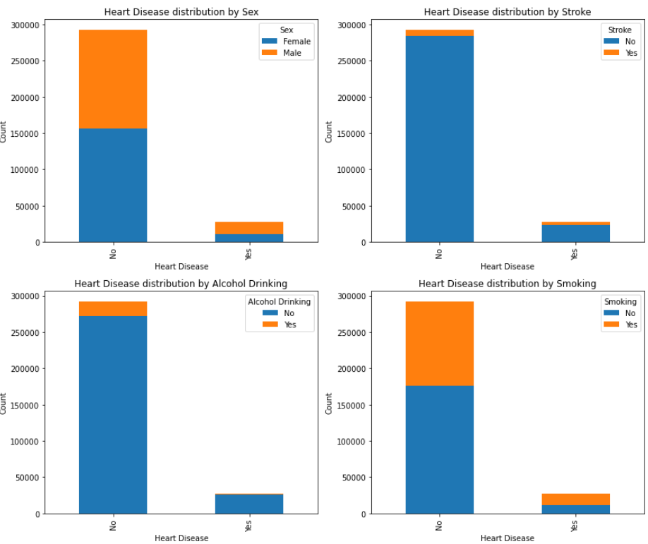
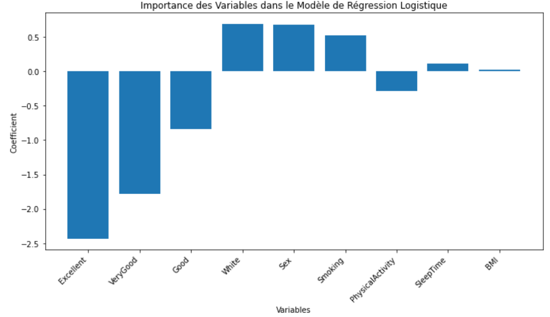
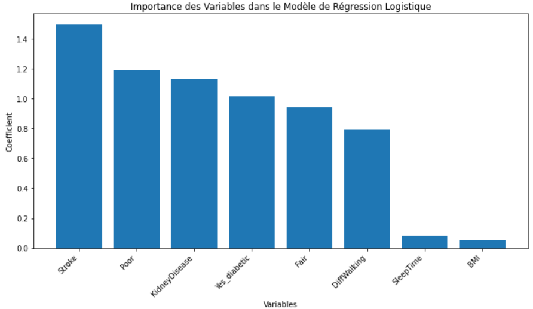
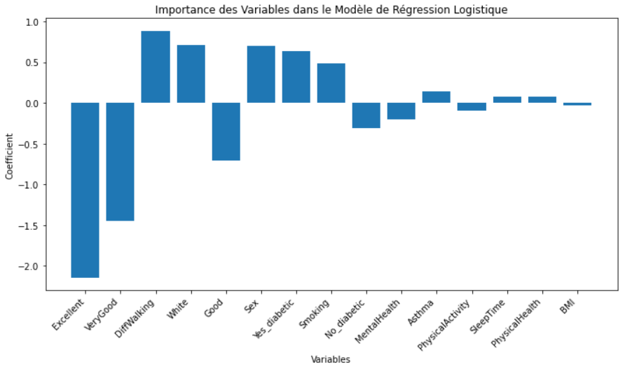
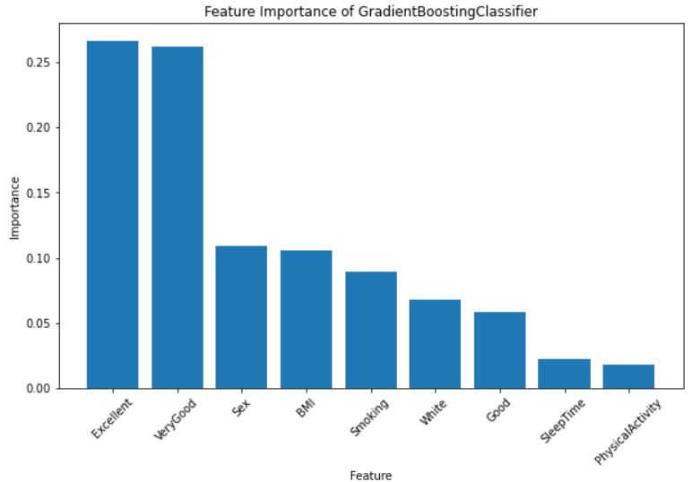

<h1 align="center">
  <b>Analyse et prédiction des maladies cardiaques</b>
</h1>

  

  <b>BAHL Lou-Ann</b>

  <b>CHATAIGNER Elie</b>

---
## I - Introduction 

Au cours des deux dernières décennies, les maladies cardiaques ont maintenu leur position de première cause de décès à l'échelle mondiale, demeurant une menace constante pour la santé mondiale. Malgré cette persistance, la situation a pris une tournure alarmante, car ces affections provoquent aujourd'hui un nombre de décès sans précédent. L'ampleur de cette détérioration se reflète dans l'augmentation de plus de 2 millions de décès liés aux maladies cardiaques depuis l'an 2000, atteignant un sommet de près de 9 millions en 2019. Cette évolution significative a propulsé les maladies cardiaques au rang de responsable de 16 % du total des décès, toutes causes confondues. Par ailleurs, l'impact dévastateur des maladies cardiaques s'étend également aux États-Unis, où en 2021, elles demeurent en tête des principales causes de décès, surpassant non seulement d'autres affections graves telles que les cancers et la COVID-19, mais également les accidents (blessures involontaires). Les maladies cardiaques (ou cardiovasculaires) regroupent divers troubles impactant le cœur et les vaisseaux sanguins. Cela englobe divers problèmes, tels que des troubles du rythme cardiaque ou des affections des vaisseaux. Les maladies cardiaques peuvent entraîner des complications graves, comme des crises cardiaques. Les causes sont diverses et variées : mode de vie (tabagisme, consommation excessive d'alcool, régime alimentaire malsain, stress...), facteurs génétiques, conditions médicales (hypertension artérielle, diabète, obésité...), âge, sexe et bien d'autres. 
Cette constatation met en évidence l'ampleur mondiale de la prévalence des maladies cardiaques et la nécessité impérieuse d'une action coordonnée pour atténuer leur impact dévastateur. Dans cette optique, cette analyse se concentrera spécifiquement sur le cas des Etats-Unis (premièrement pour la disponibilité des données mais également car c’est le pays le plus touché par ce fléau). En effet, cette réalité globale souligne l'urgence de comprendre et de traiter efficacement ces affections. Ainsi, l'objectif de cette étude est de prévoir ces maladies cardiaques en identifiant les paramètres influents.

---

## II - Analyse Exploratoire

Afin de réaliser notre analyse, nous avons utilisé le jeu de données "Indicateurs de maladies cardiaques" présent sur le site Kaggle [disponible ici](https://www.kaggle.com/datasets/kamilpytlak/personal-key-indicators-of-heart-disease). Initalement, cette base contient 319 795 observations avec un total de 18 variables. En raison de la taille de ce dataset, il est nécessaire d'effectuer de l'analyser (pour voir si des choses ne vont pas) et de l'explorer (afin de se familiariser avec celui-ci). Les variables présentes dans le jeu de données sont les suivantes : 

**HearthDisease:**
- Cette variable est la variable cible. Elle prend la valeur 0 si la personne n’a pas eu une maladie cardiaque et la valeur 1 si la personne en a déjà eu.

**BMI:**
- Indice de Masse Corporelle (IMC). Selon l’assurance maladie :
  - IMC < 18.5 : Sous-poids
  - 18.5 ⩽ IMC ⩽ 24.9 : Corpulence normale
  - 25 ⩽ IMC ⩽ 29.9 : Surpoids
  - IMC ⩽ 30 : Obésité

**Smoking:**
- Variable indiquant si la personne à déjà fumé plus de 100 cigarettes au cours de sa vie. Elle prend la valeur 0 si la personne n’a pas fumé plus de 100 cigarettes et 1 dans le cas contraire.

**AlcoholDrinking:**
- Variable indiquant si la personne a une consommation d’alcool jugée comme excessive (hommes adultes buvant plus de 14 verres par semaine et femmes adultes buvant plus de 7 verres par semaine). Elle prend la valeur 1 si la personne a une consommation jugée excessive et 0 en cas inverse.

**Stroke:**
- Accident cardiovasculaire cérébral (AVC). Cette variable indique si la personne à déjà eu un AVC. Elle prend la valeur 0 pour non et la valeur 1 pour oui.

**PhysicalHealth:**
- Cette variable fait référence à la santé physique de la personne (au cours des 30 derniers jours).

**MentalHealth:**
- Variable indiquant la santé mentale de l'individu interrogé (au cours des 30 derniers jours).

**DiffWalking:**
- Indique si la personne a des difficultés à marcher ou à monter les escaliers. La variable prend 0 si la personne n’a pas de difficultés et 1 si elle en a.

**Sex:**
- Genre de la personne. Elle prend la valeur 0 pour Femme et 1 pour Homme.

**AgeCategory:**
- Variable indiquant la catégorie d’âge à laquelle la personne appartient. Il y a quatorze catégories d’âge.

**Race:**
- Ethnicité de l’individu. Cette variable prend plusieurs valeurs : Asian, American Indian/Alaskan Native, Black, Hispanic, White, Other.

**Diabetic:**
- Variable signalant si la personne a déjà été informée ou alertée concernant un éventuel niveau de diabète. Cette variable peut prendre les valeurs : No, No, borderline diabetes, Yes, Yes (during pregnancy).

**PhysicalActivity:**
- Indique si la personne a déclaré avoir fait de l’activité sportive au cours des 30 derniers jours en dehors de leur profession. Cette variable prend 1 si la personne en a fait et 0 si elle n’en a pas fait.

**GenHealth:**
- État de santé selon l’individu. Cette variable peut prendre les valeurs : Excellent, Very good, Good, Fair, Poor.

**SleepTime:**
- Heures de sommeil de l’individu en moyenne (en 24h).

**Asthme:**
- Variable indiquant si l’individu a fait/fait de l'asthme. Elle prend 1 pour oui et 0 pour non.

**KidneyDisease:**
- Variable indiquant si la personne souffre d’une maladie rénale (en dehors des calculs rénaux, des infections de la vessie ou de l'incontinence). Cette variable prend la valeur 0 pour non et 1 pour oui.

**SkinCancer:**
- Indique si la personne a un cancer de la peau. La variable prend la valeur 0 pour non et 1 pour oui.

### II.1 - Statistiques univariées

#### II.1.1 - Target

  <b>Figure 1 :</b> Répartition de la variable cible

&nbsp;&nbsp;

   

La variable cible présente un fort déséquilibre, avec seulement 8,6% des individus ayant connu une maladie cardiaque, contre 91,4% sans antécédents. Cette asymétrie nécessitera l'application de techniques de rééchantillonnage pour assurer une représentation équilibrée des classes lors de la modélisation prédictive. Cet ajustement est crucial pour garantir la performance et la fiabilité des futurs modèles, prenant ainsi en compte la réalité du déséquilibre dans la variable cible.

### II.2 - Statistiques bivariées

Grâce aux graphiques ci-dessous, nous pouvons tirer quelques conclusions. Tout d'abord, il est observé que les hommes semblent présenter une prévalence plus élevée de maladies cardiaques par rapport aux femmes. Ensuite, une observation particulièrement marquante concerne la proportion d'accidents vasculaires cérébraux (AVC) chez les individus ayant déjà été victimes de maladies cardiaques, comparativement à ceux n'ayant pas de maladies cardiaques. Il apparaît que la proportion d'AVC est notablement plus élevée chez le premier groupe, soulignant une association potentielle entre les maladies cardiaques et les risques d'AVC. En ce qui concerne le tabagisme, une corrélation intéressante se dessine : parmi les individus sans maladies cardiaques, la proportion de non-fumeurs est supérieure à celle des fumeurs. Cependant, cette tendance s'inverse chez les personnes souffrant de maladies cardiaques, indiquant un possible lien entre le tabagisme et les affections cardiaques. Paradoxalement, en ce qui concerne la consommation excessive d'alcool, les données révèlent une proportion apparemment plus élevée chez les individus n'ayant pas de maladies cardiaques. 

  <b>Figure  2 :</b> Statistiques bivariées

&nbsp;&nbsp;

   

### II.3 - Statistiques descriptives

L'analyse des données recueillies révèle plusieurs éléments significatifs concernant la santé et la démographie au sein de l'échantillon étudié. En termes d'Indice de Masse Corporelle (BMI), la moyenne observée est d'environ 28,33, avec une légère variabilité, comme indiqué dans le Tableau 1. Les comportements liés à la santé, tels que le tabagisme (41,25%) et la consommation d'alcool (6,81%), reflètent des habitudes variées au sein de la population. Au sein de l’échantillon, il y a plus de femmes que d’hommes et la plupart des individus estiment que leur santé est très bonne. 

<b>Tableau 1 :</b> Statistiques descriptives des variables

|               | **HeartDisease** | **BMI** | **Smoking** | **AlcoholDrinking** | **Stroke** | **PhysicalHealth** | **MentalHealth** | **DiffWalking** | **Sex** | **AgeCategory** | **Race** | **Diabetic** | **PhysicalActivity** | **GenHealth** | **SleepTime** | **Asthma** | **KidneyDisease** | **SkinCancer** |
|--------------|------------------|---------|-------------|---------------------|------------|---------------------|------------------|-----------------|--------|-----------------|----------|--------------|-----------------------|--------------|---------------|------------|-------------------|----------------|
| **count**    | 319795           | 319795  | 319795      | 319795              | 319795     | 319795              | 319795           | 319795          | 319795 | 319795          | 319795   | 319795       | 319795                | 319795       | 319795        | 319795     | 319795            | 319795         |
| **unique**   | 2                |         | 2           | 2                   | 2          |                     |                  | 2               | 2      | 13              | 6        | 4            | 2                     | 5            |               | 2          | 2                 | 2              |
| **top**      | No               |         | No          | No                  | No         |                     |                  | No              | Female | 65-69           | White    | No           | Yes                   | Very good    |               | No         | No                | No             |
| **freq**     | 292422           |         | 187887      | 298018              | 307726     |                     |                  | 275385          | 167805 | 34151           | 245212   | 269653       | 247957                | 113858       |               | 276923     | 308016            | 289976         |
| **mean**     |                  | 28.33   |             |                     |            | 3.37                | 3.90             |                 |        |                 |          |              |                       |              | 7.10          |            |                   |                |
| **std**      |                  | 6.36    |             |                     |            | 7.95                | 7.96             |                 |        |                 |          |              |                       |              | 1.44          |            |                   |                |
| **min**      |                  | 12.02   |             |                     |            | 0.00                | 0.00             |                 |        |                 |          |              |                       |              | 1.00          |            |                   |                |
| **25%**      |                  | 24.03   |             |                     |            | 0.00                | 0.00             |                 |        |                 |          |              |                       |              | 6.00          |            |                   |                |
| **50%**      |                  | 27.34   |             |                     |            | 0.00                | 0.00             |                 |        |                 |          |              |                       |              | 7.00          |            |                   |                |
| **75%**      |                  | 31.42   |             |                     |            | 2.00                | 3.00             |                 |        |                 |          |              |                       |              | 8.00          |            |                   |                |
| **max**      |                  | 94.85   |             |                     |            | 30.00               | 30.00            |                 |        |                 |          |              |                       |              | 24.00         |            |                   |                |

---

## III - Prétraitement des données

### III.1 - Valeurs manquantes

Il est important de vérifier s’il existe des valeurs manquantes puisqu’elles peuvent impacter les modèles (en compromettant la stabilité, la précision ou encore la généralisation). La base de données était déjà nettoyée et ne comportait pas de valeurs manquantes. Par conséquent, nous n’avons pas eu à les retirer ou encore à leur imputer une valeur. 

### III.2 - Type des variables

En procédant à des ajustements dans notre analyse, nous avons entrepris une transformation des types de certaines variables. Initialement, les variables qui utilisaient les valeurs "No" et "Yes" ont été converties de manière à leur attribuer respectivement les valeurs numériques 0 et 1. Cette transformation simplifie la manipulation de ces variables dans des analyses statistiques. Par ailleurs, certaines variables pouvaient prendre plusieurs modalités, nécessitant ainsi l'utilisation du `OneHotEncoder`. Cette technique a été appliquée pour transformer ces variables catégorielles en une représentation numérique adaptée à l'analyse. Le OneHotEncoder crée des variables binaires distinctes pour chaque modalité, permettant ainsi de capturer efficacement l'information contenue dans ces variables complexes. Néanmoins, l’inconvénient de cette technique est que nous nous retrouvons avec un nombre élevé de variables (42 pour être précis). Il sera certainement nécessaire d’effectuer une feature selection par la suite.  

### III.3 - Outliers

Afin que la base soit utilisable pour effectuer nos modèles, il est nécessaire d’enlever les valeurs atypiques (ou outliers) de nos variables quantitatives. Cette étape est primordiale puisque les modèles de machine learning peuvent être sensibles aux valeurs aberrantes. Leur présence peut avoir des conséquences négatives sur la performance des modèles. Ici notre objectif est de construire un modèle de prédiction de l’arrêt cardiaque qui reflète la majorité des cas donc nous choisissons de les supprimer.

  <b>Figure 3 :</b> Potentielles valeurs atypiques des variables quantitatives

&nbsp;&nbsp;

   

La Figure 3 montre qu’il existe de potentielles valeurs atypiques pour toutes nos variables quantitatives. Après la suppression des valeurs potentiellement atypiques, nous constatons qu’il en reste encore énormément. Nous avons donc joué sur le z-score (qui est une mesure statistique utilisée pour détecter et supprimer les valeurs aberrantes). Nous constatons qu’en mettant le seuil du z-score à 3, il restait toujours énormément de valeurs atypiques. En revanche, en mettant un z-score à 0.5, nous perdions un nombre non négligeable de données. Nous décidons d’appliquer un z-score de 1. Nous perdons environ 32% des données mais il nous reste un nombre élevé d’observations. En revanche, il semble toujours exister des valeurs potentiellement atypiques pour les variables faisant référence à la santé physique et la santé mentale. Il faudra donc faire particulièrement attention à ces variables.

### III.4 - Relation entre les variables

Comprendre les liens et corrélations entre les variables revêt une importance cruciale dans le domaine du machine learning. Cette analyse permet de réduire la dimensionnalité en éliminant des variables redondantes, simplifiant ainsi le modèle tout en préservant ses performances.

#### III.4.1 - Variables quantitatives

La Figure 3 nous montre qu’il n’existe aucune corrélation significative (c’est-à-dire de très forte corrélation positive ou négative). Nous pouvons donc conserver toutes nos variables quantitatives.

  <b>Figure 4 :</b> Corrélations entre les variables quantitatives

&nbsp;&nbsp;

   

#### III.4.2 - Variables qualitatives

Pour les variables de type qualitatif, nous avons effectué le test de Chi-2 pour voir l’indépendance entre les variables. L’hypothèse nulle stipule qu’il n’y a aucun lien significatif entre les variables. Nous avons donc testé tous les couples de variables. En revanche, cette fois-ci, nous constatons qu’il existe énormément de liens entre nos variables qualitatives. Par conséquent, nous ne pourrons pas toutes les garder dans l’analyse.

#### III.4.3 - Variables quantitives & qualitatives

Pour finir, nous regardons s’il existe des différences significatives entre les personnes n’ayant pas de maladie cardiaque et les autres vis-à-vis des variables quantitatives. Pour ce faire, nous utilisons le test t de Student. Ce test est utilisé pour comparer les moyennes de deux groupes. L’hypothèse nulle est la suivante : il n'y a pas de différence significative entre les moyennes des deux échantillons.

  <b>Tableau 2 :</b> Statistiques du test t de Student

&nbsp;&nbsp;
| Variable         | P-value            |
|------------------|--------------------|
| HearthDisease & BMI              |2.7721495948880634e-175 |
| HearthDisease & MentalHealth     | 1.4801017749729575e-45 |
| HearthDisease  & PhysicalHealth   | 0 |
| HearthDisease  & SleepTime        | 0.00011331398017915307 |

Grâce au tableau 2, nous constatons qu’il y a des différences significatives d’IMC, de santé mentale, de santé physique et de temps de sommeil entre les personnes qui n’ont pas de maladies cardiaques et celles qui en ont. Ces résultats suggèrent que ces caractéristiques peuvent être des indicateurs pertinents pour la prédiction des maladies cardiaques.

### III.5 - Relation entre les variables

En raison des nombreuses variables catégorielles liées, nous décidons d’en enlever. Pour choisir lesquelles garder (ou lesquelles enlever), un Chi2 Feature Selection a été réalisé. La sélection de caractéristiques basée sur le test du Chi2 évalue l'indépendance statistique entre chaque caractéristique d'un ensemble de données et la variable cible. Elle utilise le test du Chi2 pour mesurer la divergence entre les fréquences observées et attendues des différentes catégories de chaque caractéristique par rapport à la variable cible. Les caractéristiques sont ensuite classées en fonction de leur capacité à discriminer la variable cible, permettant ainsi de sélectionner les caractéristiques les plus informatives. Les features sélectionnées sont dans le tableau 3.

  <b>Tableau 3 :</b> Features qualitatives sélectionnées (Chi2 Feature Selection)

&nbsp;&nbsp;
| Stroke | DiffWalking | KidneyDisease | SkinCancer | Excellent | Fair | Poor | 75-79 | 80+ | Yes_diabetic |
|--------|-------------|----------|---------------|-----------|------|------|-----------|-------------------|--------------------------|
|   ✅  |      ✅      |    ✅    |       ✅        |     ✅    |  ✅  |  ✅  |     ✅    |         ✅         |           ✅            |

Avec ces variables, nous rajoutons nos 4 variables quantitatives et nous obtenons ainsi un dataframe constitué de 14 variables explicatives. 

Pour une seconde partie de l’analyse, nous pensons qu’il pourrait être intéressant d’avoir d’autres variables car elles pourraient potentiellement apporter une information supplémentaire et intéressante. Nous réalisons une méthode de sélection basée sur la variance à savoir la "Variance-based feature selection". Les caractéristiques qui ne changent pas beaucoup d’un échantillon à l’autre sont éliminées en supposant que ces caractéristiques n’apportent pas beaucoup d’informations. Nous obtenons les features disponibles dans le tableau 4.

  <b>Tableau 4 :</b> Features qualitatives sélectionnées (Variance-based feature selection)

&nbsp;&nbsp;

| Stroke | DiffWalking | KidneyDisease | SkinCancer | Excellent | Good | VeryGood | White | No_diabetic | Yes_diabetic |
|--------|-------------|---------------|------------|-----------|------|----------|-------|-------------|--------------|
|   ✅   |      ✅      |      ✅       |      ✅      |     ✅    |  ✅  |    ✅     |   ✅  |      ✅      |      ✅       |

---

## IV - Préparation des données 

### IV.1 - Split du jeu de données

Dans cette partie de l’analyse, nous avons divisé notre jeu de données en ensembles d’entraînement et de test. Cette étape est essentielle pour évaluer la capacité du modèle à généraliser à de nouvelles données non vues pendant l'entraînement. Ensuite, nous avons toujours ce problème de déséquilibre sur notre variable cible. Ce déséquilibre pourrait avoir un impact significatif sur la performance des modèles, car ils peuvent être biaisés vers la classe majoritaire (en l'occurrence, les personnes n'ayant pas eu de maladie cardiaque). En d'autres termes, le modèle pourrait montrer une préférence à anticiper que la personne interrogée n'a pas eu de maladie cardiaque, simplement parce que la majorité des exemples d'entraînement appartiennent à cette classe. Pour résoudre ce problème de déséquilibre de classes, on peut utiliser le suréchantillonnage (ajout d'instances de la classe minoritaire) et le sous-échantillonnage (réduction d'instances de la classe majoritaire) afin d'assurer une distribution plus équilibrée et d'améliorer la performance du modèle. Dans ce contexte, il peut être préférable d'effectuer un sous-échantillonnage. De plus, les personnes ayant fait une ou des maladies cardiaques présentent probablement des caractéristiques assez spécifiques. Nous effectuons ce ré échantillonnage uniquement sur les données sur le jeu d'entraînement afin de préserver l’intégrité des données de test intactes. Nous obtenons une distribution équitable (cf Figure ci-dessous).

  <b>Figure 5 :</b> Répartition de la variable cible après ré-échantillonnage sur entraînement

&nbsp;&nbsp;

   

### IV.2 - Standardisation

Ensuite, nous avons standardisé nos variables. Ce processus permet de centrer et normaliser les caractéristiques d’un ensemble de données en ajustant leur échelle (en éliminant ainsi les disparités d’unités). La standardisation permet d’améliorer la performance des modèles, de faciliter la convergence des algorithmes, de l’efficacité et la stabilité des modèles.

---

## V - Modélisation

Désormais, nous allons procéder à différents modèles. L’objectif est de trouver le modèle le plus performant. Pour ce faire, nous avons utilisé 4 approches.
- Un modèle en utilisant les 14 features de la Chi2 feature selection
- Un modèle en utilisant 8 variables en partie issue de la feature selection (puisque nous avons vu qu’il y avait surtout 6 variables importantes dans notre premier meilleur modèle et nous avons supprimé les deux variables contenant des outliers)
- Un modèle en utilisant 15 variables issues de la variance-based feature selection
- Un modèle en utilisant 9 variables en faisant comme précédemment

### V.1 - Modèles utilisés 

Nous avons réalisé plusieurs modèles pour ces différentes approches  à savoir : 

- **Régression logistique (Logistic Regression):** Un modèle de classification linéaire qui utilise la fonction logistique pour prédire la probabilité d'appartenance à une classe.

- **SVM linéaire (Linear SVM):** Un modèle de classification qui cherche à trouver un hyperplan optimal pour séparer les classes dans l'espace des caractéristiques.

- **SVM avec noyau linéaire (SVM avec kernel linéaire):** Une variante du SVM utilisant un noyau linéaire pour gérer des problèmes de séparation non linéaire.

- **SVM avec noyau RBF (SVM avec noyau RBF):** Utilise un noyau RBF (Radial Basis Function) pour permettre une séparation plus complexe et non linéaire des données.

- **SVM avec noyau polynomial (SGD poly):** Un SVM utilisant un noyau polynomial pour effectuer une séparation non linéaire.

- **Classificateur SGD (SGD Classifier):** Un classificateur linéaire qui utilise la descente de gradient stochastique pour minimiser la fonction de perte.

- **Random Forest (RandomForestClassifier):** Un ensemble d'arbres de décision qui agrège leurs prédictions pour améliorer la robustesse et la généralisation du modèle.

- **Gradient Boosting (GradientBoostingClassifier):** Un modèle ensembliste qui construit des arbres de décision séquentiels, chaque arbre corrigeant les erreurs du précédent.

- **XGBoost (XGBClassifier):** Une implémentation optimisée de l'algorithme de gradient boosting, connue pour sa vitesse et sa performance.

- **K-Nearest Neighbors (KNeighborsClassifier):** Un modèle de classification basé sur la proximité, où les prédictions sont faites en fonction des classes des k voisins les plus proches.

- **Réseau de neurones:** Un modèle d'apprentissage profond qui consiste en des couches de neurones interconnectés, utilisés pour capturer des relations complexes dans les données.

Nous utiliserons l’accuracy et le F1 - Score comme métriques. L’accuracy (ou la précision) dans le cas des maladies cardiaques indique la capacité du modèle à éviter de faire des prédictions de maladie cardiaque lorsqu'il n’y en a pas réellement. Dans le contexte de la détection de maladies cardiaques, un F1 - Score élevé indiquerait que le modèle parvient bien à équilibrer la capacité à identifier les personnes atteintes de maladies cardiaques tout en minimisant les diagnostics incorrects.

### V.2 - Meilleurs modèles

Nous avons effectué quatre analyses différentes, où nous avons testé tous les modèles mentionnés précédemment pour chacune d'elles. Pour prendre une décision, nous nous sommes principalement basés sur l'accuracy. Pour cela, nous avons utilisé une validation croisée à 5 partitions pour tous les modèles, afin de choisir celui qui pourrait bénéficier d'un ajustement supplémentaire. Même si certains modèles semblaient plus stables que d'autres en termes d'écart-type, nous avons remarqué que tous les modèles étaient assez fiables dans l'ensemble. Sur l’annexe 1, nous avons mis la représentation graphique du tableau 5.

  <b>Tableau 5 :</b> Accuracy selon les modèles et les cas

&nbsp;&nbsp;
|  | Cas 1 : 14 variables | Cas 2 : 8 variables | Cas 3 : 15 variables | Cas 4 : 9 variables |
|------------------------|---------------------|---------------------|----------------------|---------------------|
| Régression logistique | **0.6848** | **0.6731**  | **0.7081**   | 0.6786  |
| Linear SVM            | 0.6836  | 0.6730  | 0.7077  | 0.6596  |
| SVM avec kernel       | 0.6605  | 0.6614  | 0.7027   | 0.6582  |
| SVM avec noyau RBF    | 0.6799  | 0.6731  | 0.6992   | 0.6582  |
| SGD poly              | 0.6806 | 0.6727  |  0.7000 | 0.6585  |
| SGD classifier        | 0.6608  | 0.6159  | 0.6979 | 0.5993  |
| Random Forest         | 0.6010  | 0.6156  | 0.6461  | 0.6055  |
| Gradient Boosting     | 0.6805  | 0.6727  | 0.7051   | **0.6799**  |
| XGBoost               | 0.6667  | 0.6605  | 0.6867   | 0.6663  |
| K-Nearest Neighbors   | 0.6287 | 0.6455 | 0.6569  | 0.6348 |

Nous constatons que la régression logistique à une meilleure précision pour 3 cas et le gradient boosting pour le 4e cas. Nous allons effectuer un Grid Search sur les modèles ayant eu les meilleurs résultats afin d’essayer d’encore améliorer leurs performances.

### V.3 - Exploration paramétrique

La première chose surprenante des résultats issus du Grid Search est que celui-ci améliore la précision dans un seul cas (le numéro 4). Nous reviendrons sur ces résultats dans la discussion.

  <b>Tableau 6 :</b> Comparaisons selon les modèles après Grid Search

&nbsp;&nbsp;
| | Cas 1 : 14 variables | Cas 2 : 8 variables | Cas 3 : 15 variables | Cas 4 : 8 variables |
|-----------|-----------|-----------|-----------|-----------|
| Accuracy : Train   |    0.6848       |   0.6731        |  **0.7078**         |   0.6989        |
| Accuracy : Test   |     0.6857      |    **0.7977**       |   0.7076        |  0.6727         |
| F1 - Score : Train   |  0.6824         |    0.6174       |    **0.7038**       |    0.7029       |
| F1 - Score : Test   |    0.2269       |   **0.2563**        |   0.2390        |   0.2282        |

Le tableau présente les performances de nos différentes cas. Le Cas 2 se démarque avec la meilleure performance sur l'ensemble de test, affichant une exactitude de 0.7977 et un score F1 de 0.2563, malgré l'utilisation d'un nombre limité de variables. Le Cas 3 suit de près avec des performances solides, utilisant un ensemble plus large de 15 variables. Les Cas 1 et 4 affichent des performances similaires, bien que légèrement inférieures aux deux premiers cas. En revanche, bien que le cas 2 affiche des performances remarquables sur l'ensemble de test, avec une exactitude de 79,77% et un score F1 de 25,63%, l'écart entre ces mesures et celles de l'ensemble d'entraînement (67,31% d'exactitude et 61,74% de score F1) suggère une possible adaptation excessive aux données d'entraînement. Cela peut indiquer que le modèle a appris des caractéristiques spécifiques aux données d'entraînement qui ne se généralisent pas bien à de nouvelles données, ce qui est caractéristique du surajustement. En revanche, bien que les autres cas puissent également présenter un léger surajustement, les écarts entre les performances d'entraînement et de test sont moins prononcés, indiquant une meilleure généralisation du modèle.

### V.4 - Importance des variables

Il peut être intéressant de s’intéresser aux variables les plus importantes de nos modèles. Dans le cas de la régression logistique, l'importance des variables est déterminée par les coefficients attribués à chaque variable, reflétant leur contribution relative à la prédiction de la variable cible. En revanche, dans le GradientBoostingClassifier, l'importance des variables est évaluée en fonction de leur contribution à la réduction de l'erreur du modèle.

  <b>Figure 6 :</b> Cas 1 : Importance des variables

   

  <b>Figure 7 :</b> Cas 2 : Importance des variables

   

  <b>Figure 8 :</b> Cas 3 : Importance des variables

   

  <b>Figure 9 :</b> Cas 4 : Importance des variables

   

Cas 1 : Avoir un état de santé excellent, très bon ou bon semble diminuer la probabilité d’avoir une maladie cardiaque. En revanche, le fait d’être blanc, le genre et le fait de fumer semblent augmenter cette probabilité.
Cas 2 : Avoir fait un AVC, voir sa santé comme pauvre (ou juste), avoir une maladie rénale, être diabétique, avoir du mal à marcher semblent augmenter la probabilité d’avoir une maladie cardiaque.
Cas 3 : Il semble que les individus ayant une excellente ou une très bonne santé aient une probabilité plus faible d’avoir une maladie cardiaque. En revanche, le fait d’avoir des difficultés à marcher ou d’être blanc augmente cette probabilité.
Cas 4 : Les variables les plus importantes pour expliquer la prédiction de maladie cardiaque sont le fait d’être en excellente ou très bonne santé. Le genre, l’IMC et le fait de fumer semblent également être des variables importantes.

### V.5 - Réseau de neurones

La dernière étape de notre étude consiste à mettre en place un réseau de neurones pour chacun des cas. Nous avons directement tenté un grid search. L’objectif est d’essayer de trouver un meilleur modèle que ceux précédents. 

|             | Cas 1   | Cas 2   | Cas 3   | Cas 4   |
| ----------- | ------- | ------- | ------- | ------- |
| Accuracy    | 0.7366  | **0.7977**  | 0.7042  | 0.6617  |
| F1 - Score  | **0.2612**  | 0.2599  | 0.2427  | 0.2236  |

En effet, les résultats sont meilleurs par rapport à tous les autres modèles testés. Pour le premier cas avec 14 variables, le modèle a obtenu une accuracy de 73.66% et un F1 score de 26.12%. Cette combinaison de score que le modèle parvient à classifier correctement près de 74% des individus. Cependant le F1 - Score assez faible suggère que le modèle peut avoir des difficultés en manquant certains cas positifs de maladies cardiaques tout en classant certains individus incorrectement comme porteurs de maladie cardiaques.

Dans le deuxième cas, qui utilise seulement 8 variables, l'accuracy a augmenté à 79.77%, ce qui représente une amélioration par rapport au premier cas. Cependant, le F1 score reste similaire à 25.99%, ce qui signifie que le modèle parvient à bien identifier les cas positifs de maladie cardiaque par rapport au premier cas, mais il y a toujours des améliorations potentielles à réaliser.

Pour le troisième cas, avec 15 variables, l'accuracy est de 70.42% et le F1 score est de 24.27%. Bien que ce modèle utilise plus de variables, il semble moins performant que le deuxième cas en termes d'accuracy et de F1 score. Cela peut indiquer que certaines variables supplémentaires n'ajoutent pas de valeur prédictive significative ou peuvent introduire du bruit dans le modèle.

Enfin, dans le dernier cas avec 10 variables, l'accuracy est de 66.17% et le F1 score est de 22.36%. Ce modèle semble être le moins performant des quatre cas, ce qui suggère que la réduction du nombre de variables a eu un impact négatif sur sa capacité à prédire correctement les cas de maladie cardiaque.

---

## VI - Conclusion

---

## VII - Discussion

**Difficultées rencontrées :** Nous avons essayé de réaliser un modèle sans ré-échantillonné pour voir s’il était utile d’avoir effectué un sous-échantillonnage mais les modèles ont pris un temps considérable à charger donc nous n’avons pas pu le réaliser. De plus, la majorité des Grid Search ont également un temps conséquent à run. 

Nous pouvons également discuter des variables du dataset relatives à la santé des individus. En effet, évaluer sa propre santé est souvent une démarche subjective. Par exemple, une personne avec une santé moyenne pourrait se considérer en bonne santé simplement parce qu'elle pense qu'il y a des gens en moins bonne santé qu'elle

Pour finir, il pourrait être intéressant de réaliser les mêmes modèles en utilisant des données provenant d’un pays différent pour voir si nous obtenons les mêmes résultats. 
**PARLER DU GRIDSEARCH**

---

## VIII - Annexe

---

## Bibliographie

OMS, Maladies cardiovasculaires, https://www.who.int/fr/news-room/fact-sheets/detail/cardiovascular-diseases-(cvds)#:~:text=Les%20maladies%20cardiovasculaires%20constituent%20un,sanguins%20qui%20alimentent%20le%20cerveau)

OMS, Principales causes de mortalité et d’incapacité dans le monde : 2000-2019, https://www.who.int/fr/news/item/09-12-2020-who-reveals-leading-causes-of-death-and-disability-worldwide-2000-2019#:~:text=Les%20maladies%20cardiaques%20sont%20rest%C3%A9es,millions%20de%20d%C3%A9c%C3%A8s%20en%202019.

Statista, Répartition des premières causes de décès aux États-Unis en 2021, https://fr.statista.com/statistiques/564002/premieres-causes-de-deces-aux-etats-unis/#:~:text=Cette%20statistique%20repr%C3%A9sente%20la%20r%C3%A9partition,des%20d%C3%A9c%C3%A8s%20aux%20%C3%89tats%2DUnis.

---

