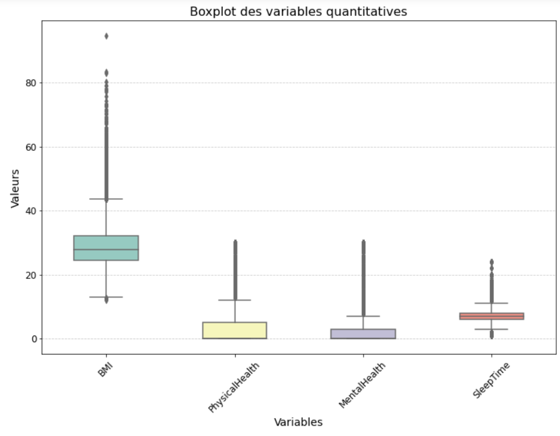
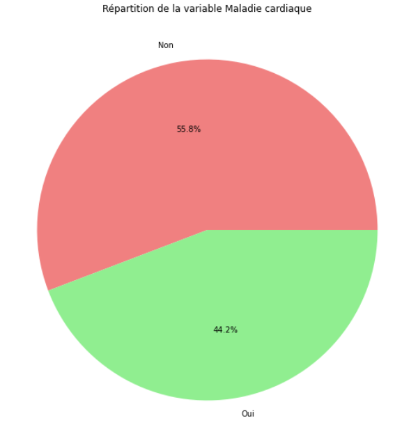
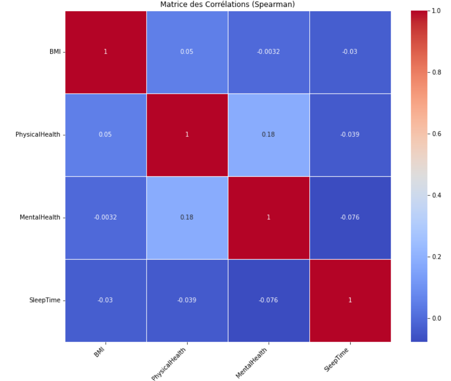

<h1 align="center">
  <b>Analyse et prédiction des maladies cardiaques</b>
</h1>

  

  <b>BAHL Lou-Ann</b>

  <b>CHATAIGNER Elie</b>

---
## I. Introduction 

Au cours des deux dernières décennies, les maladies cardiaques ont maintenu leur position de première cause de décès à l'échelle mondiale, demeurant une menace constante pour la santé mondiale. Malgré cette persistance, la situation a pris une tournure alarmante, car ces affections provoquent aujourd'hui un nombre de décès sans précédent. L'ampleur de cette détérioration se reflète dans l'augmentation de plus de 2 millions de décès liés aux maladies cardiaques depuis l'an 2000, atteignant un sommet de près de 9 millions en 2019. Cette évolution significative a propulsé les maladies cardiaques au rang de responsable de 16 % du total des décès, toutes causes confondues. Par ailleurs, l'impact dévastateur des maladies cardiaques s'étend également aux États-Unis, où en 2021, elles demeuraient en tête des principales causes de décès, surpassant non seulement d'autres affections graves telles que les cancers et la COVID-19, mais également les accidents (blessures involontaires). Les maladies cardiaques (ou cardiovasculaires) regroupent divers troubles impactant le cœur et les vaisseaux sanguins. Cela englobe divers problèmes, tels que des troubles du rythme cardiaque ou des affections des vaisseaux. Les maladies cardiaques peuvent entraîner des complications graves, comme des crises cardiaques. Les causes sont diverses et variées : mode de vie (tabagisme, consommation excessive d'alcool, régime alimentaire malsain, stress...), facteurs génétiques, conditions médicales (hypertension artérielle, diabète, obésité...), âge, sexe et bien d'autres.

Cette constatation met en évidence l'ampleur mondiale de la prévalence des maladies cardiaques et la nécessité impérieuse d'une action coordonnée pour atténuer leur impact dévastateur. En effet, cette réalité globale souligne l'urgence de comprendre et de traiter efficacement ces affections. Ainsi, l'objectif de cette étude est de prévoir ces maladies cardiaques en identifiant les paramètres influents.

**DIRE COMMENT ON VA FAIRE AVEC QUELLE BASE** + dire que c'est USA

---

## II. Analyse Exploratoire

Afin de réaliser notre analyse, nous avons utilisé le jeu de données "Indicateurs de maladies cardiaques" présent sur le site Kaggle [disponible ici](https://www.kaggle.com/datasets/kamilpytlak/personal-key-indicators-of-heart-disease). Initalement, cette base contient 319 795 observations avec un total de 18 variables. En raison de la taille de ce dataset, il est nécessaire d'effectuer de l'analyser (pour voir si des choses ne vont pas) et de l'explorer (afin de se familiariser avec celui-ci).

### II.1 - Variable target

Premièrement, il est impératif d'effectuer une analyse approfondie de la distribution de la variable dépendante. Notre variable dépendante est binaire, prenant la valeur 0 si la personne interrogée n'a pas eu de maladie cardiaque et 1 si elle en a eu une. En examinant la distribution de la variable dépendante (cf. graphique ci-dessous à gauche), on peut identifier un fort déséquilibre. Autrement dit, les classes ne sont pas équilibrées : 8.6% des personnes ont déjà été victimes d'une maladie cardiaque, ce qui signifie que 91.4% des individus n'en ont pas souffert. Ce déséquilibre pourrait avoir un impact significatif sur la performance des modèles, car ils peuvent être biaisés vers la classe majoritaire (en l'occurrence, les personnes n'ayant pas eu de maladie cardiaque). En d'autres termes, le modèle pourrait montrer une préférence à anticiper que la personne interrogée n'a pas eu de maladie cardiaque, simplement parce que la majorité des exemples d'entraînement appartiennent à cette classe. Pour résoudre ce problème de déséquilibre de classes, on peut utiliser le suréchantillonnage (ajout d'instances de la classe minoritaire) et le sous-échantillonnage (réduction d'instances de la classe majoritaire) afin d'assurer une distribution plus équilibrée et d'améliorer la performance du modèle. Dans ce contexte, il peut être préférable d'effectuer un sous-échantillonnage. De plus, les personnes ayant fait une ou des maladies cardiaques présentent probablement des caractéristiques assez spécifiques. La variable cible est alors équitablement répartie (cf. figure ci-dessous à droite). En supprimant aléatoirement des observations de la classe majoritaire, bien que nous en perdions un nombre non négligeable, cela ne pose pas de problème étant donné que nous conservons tout de même 56 746 observations.

  <b>Figure 1 :</b> Répartition de la target avant et après sous-échantillonnage

&nbsp;&nbsp;

  
   

### II.2 - Valeurs manquantes

Il est important de vérifier s’il existe des valeurs manquantes puisqu’elles peuvent impacter les modèles (en compromettant la stabilité, la précision ou encore la généralisation). La base de données était déjà nettoyée et ne comportait pas de valeurs manquantes. Par conséquent, nous n’avons pas eu à les retirer ou encore à leur imputer une valeur. 

### II.3 - Types des variables

### II.4 - Outliers

Afin que la base soit utilisable pour effectuer nos modèles, il est nécessaire d’enlever les valeurs atypiques (ou outliers) de nos variables quantitatives. Cette étape est primordiale puisque les modèles de machine learning peuvent être sensibles aux valeurs aberrantes. Leur présence peut avoir des conséquences négatives sur la performance des modèles. Ici notre objectif est de construire un modèle de prédiction de l’arrêt cardiaque qui reflète la majorité des cas donc nous choisissons de les supprimer.

  <b>Figure 2 :</b> Potentielles valeurs atypiques des variables quantitatives

&nbsp;&nbsp;

   

La Figure 2 montre qu’il existe de potentielles valeurs atypiques pour toutes nos variables quantitatives. Etant donné qu’il en existe plus de 10 pour chacunes d’entre elles, il est optimal d’effectuer un test ESD [(prit dans ce code)](https://github.com/BambelLarry/Master_2_ECAP/blob/main/Machine_Learning/SVM/Roul/Projet/Projet_Emma_Weiss_Francois_LEBRUMENT.ipynb). Néanmoins, après la suppression des valeurs potentiellement atypiques, nous constatons qu’il en reste encore énormément. Nous avons donc joué sur le z-score (qui est une mesure statistique utilisée pour détecter et supprimer les valeurs aberrantes). Nous constatons qu’en mettant le seuil du z-score à 3, il restait toujours énormément de valeurs atypiques. En revanche, en mettant un z-score à 0.5, nous perdions un nombre non négligeable de données. Nous décidons d’appliquer un z-score de 1. Nous perdons environ 32% des données mais il nous reste un nombre élevé d’observations. En revanche, il semble toujours exister des valeurs potentiellement atypiques pour les variables faisant référence à la santé physique et la santé mentale. Il faudra donc faire particulièrement attention à ces variables.

---

## III - Analyse statistique appronfie

Maintenant que nous avons nettoyé notre base, nous allons entrer plus en détail dans l’analyse en étudiant les différentes statistiques et relations entre les variables. Cette étape est primordiale avant de construire nos modèles.

### III.1 - Statistiques univariées

#### III.1.1 - Variable target

À la suite de l'élimination d'observations atypiques, la répartition de la variable cible a subtilement évolué, révélant désormais que 58.8% des cas ne présentent pas d'arrêt cardiaque, contrairement à 44.2% des individus de la base (cf Figure 3). Bien que la répartition ne soit pas parfaitement équilibrée à parts égales, la variable cible n'est pas catégorisée comme déséquilibrée

  <b>Figure 3 :</b> Répartition de la target sans valeurs atypiques

&nbsp;&nbsp;

   

#### III.1.2 - Variables explicatives

L'Indice de Masse Corporelle (BMI) présente une moyenne d'environ 27,85 avec une légère variabilité (cf Tableau 1). Les comportements liés à la santé, tels que le tabagisme et la consommation d'alcool, montrent des taux respectifs de 45,3% et 5,4%. Les statistiques révèlent également des aspects liés à la santé physique et mentale, avec des indices moyens de 1,17 et 0,96 respectivement. Les caractéristiques démographiques indiquent une répartition équilibrée entre les sexes, avec environ 58,5% de femmes, et une diversité dans les groupes d'âge et les catégories raciales. Ces données offrent un aperçu global des différentes dimensions de la santé et de la diversité démographique au sein de cet échantillon.

<b>Tableau 1 :</b> Statistiques descriptives des variables

|                     | HeartDisease |     BMI     |   Smoking   | AlcoholDrinking |    Stroke    | PhysicalHealth | MentalHealth | DiffWalking |     Sex     |  Diabetic   | ... | AgeCategory_65-69 | AgeCategory_70-74 | AgeCategory_75-79 | AgeCategory_80_or_older | Race_American | Race_Asian | Race_Black | Race_Hispanic | Race_Other | Race_White |
|:-------------------:|:------------:|:-----------:|:-----------:|:---------------:|:------------:|:--------------:|:------------:|:-----------:|:-----------:|:------------:|-----|-------------------|-------------------|-------------------|--------------------------|----------------|------------|------------|---------------|------------|------------|
|        count        |   26590.000  | 26590.000   | 26590.000   |    26590.000    |   26590.000  |   26590.000    |   26590.000  | 26590.000  |   26590.000 |  26590.000   | ... |    26590.000      |     26590.000     |     26590.000     |        26590.000        |   26590.000   |  26590.000 |  26590.000 |   26590.000   | 26590.000  | 26590.000  |
|         mean        |    0.442     |  27.854892  |   0.452689  |      0.053516    |    0.06446   |    1.171719    |    0.956149  |   0.125686 |    0.585483 |    0.177435  | ... |      0.132305     |      0.140015     |      0.106769     |          0.130162         |     0.014253   |   0.019293 |   0.056111 |    0.068635   |   0.028281 |   0.813426 |
|          std        |    0.497     |   3.298409  |   0.497766  |      0.225065    |   0.245576   |    2.985478    |    2.270418  |   0.331502 |    0.492648 |    0.382044  | ... |      0.338829     |      0.347009     |      0.308826     |          0.336488         |     0.118536   |   0.137555 |   0.230141 |    0.252837   |   0.165778 |   0.389576 |
|          min        |      0.0      |   22.38     |      0.0    |        0.0       |      0.0     |      0.0       |      0.0     |     0.0    |      0.0    |      0.0     | ... |        0.0        |        0.0        |        0.0        |           0.0            |       0.0      |     0.0    |     0.0    |      0.0      |     0.0    |     0.0    |
|          25%        |      0.0      |    25.1     |      0.0    |        0.0       |      0.0     |      0.0       |      0.0     |     0.0    |      0.0    |      0.0     | ... |        0.0        |        0.0        |        0.0        |           0.0            |       0.0      |     0.0    |     0.0    |      0.0      |     0.0    |     1.0    |
|          50%        |      0.0      |   27.44     |      0.0    |        0.0       |      0.0     |      0.0       |      0.0     |     0.0    |      1.0    |      0.0     | ... |        0.0        |        0.0        |        0.0        |           0.0            |       0.0      |     0.0    |     0.0    |      0.0      |     0.0    |     1.0    |
|          75%        |      1.0      |   30.27     |      1.0    |        0.0       |      0.0     |      0.0       |      0.0     |     0.0    |      1.0    |      0.0     | ... |        0.0        |        0.0        |        0.0        |           0.0            |       0.0      |     0.0    |     0.0    |      0.0      |     0.0    |     1.0    |
|          max        |      1.0      |   35.25     |      1.0    |        1.0       |      1.0     |      15.0      |      12.0    |     1.0    |      1.0    |      1.0     | ... |        1.0        |        1.0        |        1.0        |           1.0            |       1.0      |     1.0    |     1.0    |      1.0      |     1.0    |     1.0    |

### III.2 - Relations entre les variables

#### III.2.1 - Variables quantitatives

Comprendre les liens et corrélations entre les variables revêt une importance cruciale dans le domaine du machine learning. Cette analyse permet de réduire la dimensionnalité en éliminant des variables redondantes, simplifiant ainsi le modèle tout en préservant ses performances. La Figure 4 nous montre qu’il n’existe aucune corrélation significative (c’est-à-dire de très forte corrélation positive ou négative). Nous pouvons donc conserver toutes nos variables quantitatives.

  <b>Figure 4 :</b> Corrélations entre les variables quantitatives

&nbsp;&nbsp;

   

#### III.2.2 - Variables qualitatives

Pour les variables de type qualitatif, nous avons effectué le test de Chi-2 pour voir l’indépendance entre les variables. L’hypothèse nulle stipule qu’il n’y a aucun lien significatif entre les variables. Nous avons donc testé tous les couples de variables. En revanche, cette fois-ci, nous constatons qu’il existe énormément de liens entre nos variables qualitatives. Par conséquent, nous ne pourrons pas toutes les garder dans l’analyse.

#### III.2.3 - Variables quantitatives et qualitatives

### III.3 - Feature selection

**METTRE LISTE DES VARIABLES**
**random forest** ??
**tester suréchantillonage**

---

## Bibliographie

OMS, Maladies cardiovasculaires, https://www.who.int/fr/news-room/fact-sheets/detail/cardiovascular-diseases-(cvds)#:~:text=Les%20maladies%20cardiovasculaires%20constituent%20un,sanguins%20qui%20alimentent%20le%20cerveau)

OMS, Principales causes de mortalité et d’incapacité dans le monde : 2000-2019, https://www.who.int/fr/news/item/09-12-2020-who-reveals-leading-causes-of-death-and-disability-worldwide-2000-2019#:~:text=Les%20maladies%20cardiaques%20sont%20rest%C3%A9es,millions%20de%20d%C3%A9c%C3%A8s%20en%202019.

Statista, Répartition des premières causes de décès aux États-Unis en 2021, https://fr.statista.com/statistiques/564002/premieres-causes-de-deces-aux-etats-unis/#:~:text=Cette%20statistique%20repr%C3%A9sente%20la%20r%C3%A9partition,des%20d%C3%A9c%C3%A8s%20aux%20%C3%89tats%2DUnis.

---

