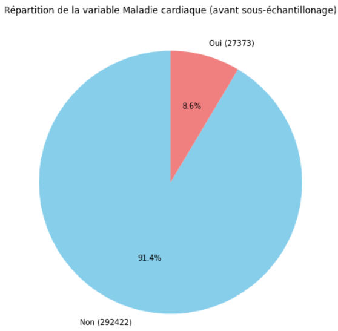
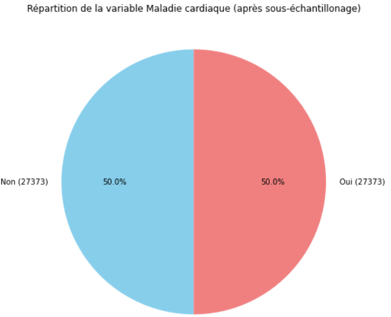

<h1 align="center">
  <b>Analyse et prédiction des maladies cardiaques</b>
</h1>

  

  <b>BAHL Lou-Ann</b>

  <b>CHATAIGNER Elie</b>

---
## I. Introduction 

Au cours des deux dernières décennies, les maladies cardiaques ont maintenu leur position de première cause de décès à l'échelle mondiale, demeurant une menace constante pour la santé mondiale. Malgré cette persistance, la situation a pris une tournure alarmante, car ces affections provoquent aujourd'hui un nombre de décès sans précédent. L'ampleur de cette détérioration se reflète dans l'augmentation de plus de 2 millions de décès liés aux maladies cardiaques depuis l'an 2000, atteignant un sommet de près de 9 millions en 2019. Cette évolution significative a propulsé les maladies cardiaques au rang de responsable de 16 % du total des décès, toutes causes confondues. Par ailleurs, l'impact dévastateur des maladies cardiaques s'étend également aux États-Unis, où en 2021, elles demeuraient en tête des principales causes de décès, surpassant non seulement d'autres affections graves telles que les cancers et la COVID-19, mais également les accidents (blessures involontaires). Les maladies cardiaques (ou cardiovasculaires) regroupent divers troubles impactant le cœur et les vaisseaux sanguins. Cela englobe divers problèmes, tels que des troubles du rythme cardiaque ou des affections des vaisseaux. Les maladies cardiaques peuvent entraîner des complications graves, comme des crises cardiaques. Les causes sont diverses et variées : mode de vie (tabagisme, consommation excessive d'alcool, régime alimentaire malsain, stress...), facteurs génétiques, conditions médicales (hypertension artérielle, diabète, obésité...), âge, sexe et bien d'autres.

Cette constatation met en évidence l'ampleur mondiale de la prévalence des maladies cardiaques et la nécessité impérieuse d'une action coordonnée pour atténuer leur impact dévastateur. En effet, cette réalité globale souligne l'urgence de comprendre et de traiter efficacement ces affections. Ainsi, l'objectif de cette étude est de prévoir ces maladies cardiaques en identifiant les paramètres influents.

**DIRE COMMENT ON VA FAIRE AVEC QUELLE BASE** + dire que c'est USA

---

## II. Analyse & exploration de la base

Afin de réaliser notre analyse, nous avons utilisé le jeu de données "Indicateurs de maladies cardiaques" présent sur le site Kaggle [disponible ici](https://www.kaggle.com/datasets/kamilpytlak/personal-key-indicators-of-heart-disease). Initalement, cette base contient 319 795 observations avec un total de 18 variables. En raison de la taille de ce dataset, il est nécessaire d'effectuer de l'analyser (pour voir si des choses ne vont pas) et de l'explorer (afin de se familiariser avec celui-ci).

### II.1 - Variable target

Premièrement, il est impératif d'effectuer une analyse approfondie de la distribution de la variable dépendante. Notre variable dépendante est binaire, prenant la valeur 0 si la personne interrogée n'a pas eu de maladie cardiaque et 1 si elle en a eu une. En examinant la distribution de la variable dépendante (cf. graphique ci-dessous à gauche), on peut identifier un fort déséquilibre. Autrement dit, les classes ne sont pas équilibrées : 8.6% des personnes ont déjà été victimes d'une maladie cardiaque, ce qui signifie que 91.4% des individus n'en ont pas souffert. Ce déséquilibre pourrait avoir un impact significatif sur la performance des modèles, car ils peuvent être biaisés vers la classe majoritaire (en l'occurrence, les personnes n'ayant pas eu de maladie cardiaque). En d'autres termes, le modèle pourrait montrer une préférence à anticiper que la personne interrogée n'a pas eu de maladie cardiaque, simplement parce que la majorité des exemples d'entraînement appartiennent à cette classe. Pour résoudre ce problème de déséquilibre de classes, on peut utiliser le suréchantillonnage (ajout d'instances de la classe minoritaire) et le sous-échantillonnage (réduction d'instances de la classe majoritaire) afin d'assurer une distribution plus équilibrée et d'améliorer la performance du modèle. Dans ce contexte, il peut être préférable d'effectuer un sous-échantillonnage. De plus, les personnes ayant fait une ou des maladies cardiaques présentent probablement des caractéristiques assez spécifiques. La variable cible est alors équitablement répartie (cf. figure ci-dessous à droite). En supprimant aléatoirement des observations de la classe majoritaire, bien que nous en perdions un nombre non négligeable, cela ne pose pas de problème étant donné que nous conservons tout de même 56 746 observations.

  <b>Figure 1 :</b> Répartition de la target avant et après sous-échantillonnage

&nbsp;

  
   

**METTRE LISTE DES VARIABLES**
**random forest** ??
**tester suréchantillonage**

---

## Bibliographie

OMS, Maladies cardiovasculaires, https://www.who.int/fr/news-room/fact-sheets/detail/cardiovascular-diseases-(cvds)#:~:text=Les%20maladies%20cardiovasculaires%20constituent%20un,sanguins%20qui%20alimentent%20le%20cerveau)

OMS, Principales causes de mortalité et d’incapacité dans le monde : 2000-2019, https://www.who.int/fr/news/item/09-12-2020-who-reveals-leading-causes-of-death-and-disability-worldwide-2000-2019#:~:text=Les%20maladies%20cardiaques%20sont%20rest%C3%A9es,millions%20de%20d%C3%A9c%C3%A8s%20en%202019.

Statista, Répartition des premières causes de décès aux États-Unis en 2021, https://fr.statista.com/statistiques/564002/premieres-causes-de-deces-aux-etats-unis/#:~:text=Cette%20statistique%20repr%C3%A9sente%20la%20r%C3%A9partition,des%20d%C3%A9c%C3%A8s%20aux%20%C3%89tats%2DUnis.

---

